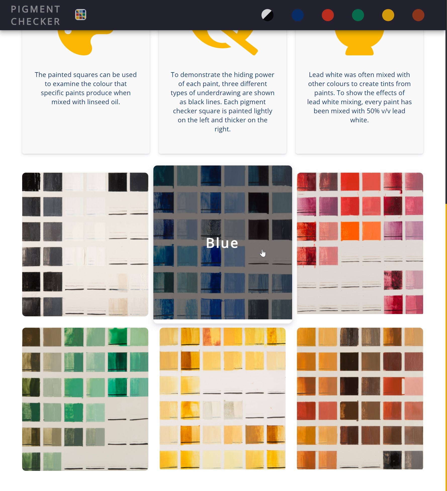

# Pigment Checker Explorer

### By: 
Laurens van Giersbergen

### [Video demo](https://youtu.be/Mb2XnOOAni8)

---

### Description:

#### The Pigment Checker
The _Pigment Checker_ is a reference collection of 17th century Dutch paints that have been prepared in the traditional manner of the time. The collection was prepared by students of the _Technical Art History_ Master's programme at the University of Amsterdam to serve as point of reference for researchers in the technical art history field.

The paint squares are applied across 6 traditionally prepared boards with a chalk ground and are grouped by colour. During the application, certain characteristics of the paint, such as colour and handling, were recorded to serve as additional information besides the resulting colour.

Each painted square is accompanied by a second square where it is mixed with 50% v/v lead white paint. These mixtures are shown because mixing paints with lead white to create tints of a colour was extraordinarily common in the seventeenth century Dutch painting practice.

#### The website
This website has been developped to allow the information in the _Pigment Checker_ project to be used globally by researchers. It can be used to identify paints by their colour, explore what paints may have looked like when they were applied originally, how paints handle during application, and much more. 

The information is presented hierarchically through the grouping by colour of the different painted boards. Each colour can easily be accessed by selecting the board from the homepage or clicking on the coloured circle in the navbar.

After a colour is selected, the user is presented with all the coloured squares associated with that colour, including some basic information per square (name & manufacturer). Upon clicking a square, a modal presents the user with more detailed information on the selected paint.

|  |  |
|-|-|

---

Information available for most pigments: name, colour, alias, manufacturer, description, initial observations, colour & translucency, opacity, resistance, stringiness, observations during grinding, details, shape, scratching, smoothness, impasto, grittiness, observations during application, colour intensity, glossiness, hiding power, tinting strength, observations during mixing with lead white, observations during application with lead white.

---

#### Design
The `Flask` app is contained in the `app.py` file. It contains information on the 6 painted boards in a constant variable to allow for dynamic page generation. It is also used to collect data from the `pigments.db` SQLite database on the different painted squares.

`layout.html` contains the parts of the website that are present on each page, such as the imports in the `<head>`, the navigation bar and the footer. The navbar and footer are styled in the `utilities.scss` file. For some extra flair and responsive design, the navbar moves to the bottom of the page on small screens.

`index.html` contains the homepage design, styled by the `style.scss` file. I strived for a modern look on the homepage, while communicating the most important aspects of the website. Using overhanging images and cards give the homepage a modern look. The boards at the bottom of the page provide a nice overview of the project, as well as providing a secondary way of navigation. Animating the boards to grow and overlaying the colour name in text again provides a modern feel and provides the user with clear feedback. It shows what is being hovered in text for colourblind people and provides a tactile avenue to alert the user to the option of clicking the board.

Navigating to a colour results shows a page created from the `board.html` template. It shows squares for each available paint, loaded from the `pigments.db` database. Upon hovering the square increases size and transforms into a small card, again signifying that the square can be selected. Upon selecting a paint square, it is transformed into a modal which contains additional information. The modal can be closed using the `X` button or clicking outside it.

The website is completely responsive, presenting a streamlined interface on mobile devices. When the window gets too small, the logo text is hidden in the navbar. If the window becomes even smaller, the navbar moves towards the bottom to be more easily accesible for mobile users. White spaces, such as margins and superfluous visual flair is also reduced for an improved mobile experience. 

Initially, I attempted to make the website fully static so it could be hosted for free. However, this created unwieldy html files, which are much cleaner using `Flask` with templating. Additionally, the website loads much faster due to the lazy loading of the many images that are present on each page. Storing the data about the squares in an SQLite table makes it easy to select the relevant data or to update information when required, without having to change anything else in the code.